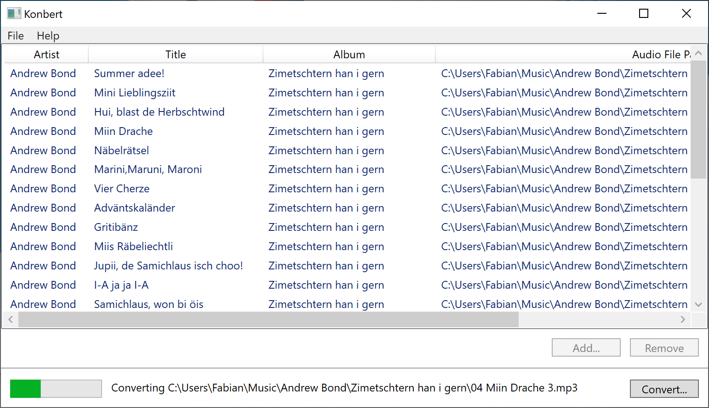

# Konbert

## Description

The [Hörbert](https://www.hoerbert.com/) audio player requires a specific WAV format (32khz, 16bit, Mono) and file name (0.WAV, 1.WAV, ...) to play an audio file on this device. This Windows Utility uses [NAudio](https://github.com/naudio/NAudio) to convert audio files (e.g. mp3, m4a, wma, etc.) to the required audio format.

## Usage

1. Start Konbert
2. Add audio files (e.g. mp3, m4a, wma) by clicking the `Add...` button
2. Click on `Convert...` and select the destination folder in which the converted files should be stored
